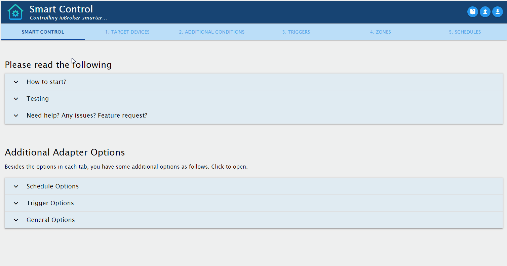

# ioBroker.smartcontrol

**Tests:**: 

## Smart Control Adapter for ioBroker

Control devices smarter: by grouping, including triggers like motion, opening window, etc. and set target devices accordingly.

Adapter icon made by [freepik](https://www.flaticon.com/authors/freepik) from [flaticon.com](https://www.flaticon.com/).

## Forum Links
* **Current Thread: [Test Adapter SmartControl 0.2.x GitHub](https://forum.iobroker.net/topic/36053/)**
* 19.07. - 18.08.2020 : [Teste Adapter SmartControl 0.1.1-beta.x](https://forum.iobroker.net/topic/35308/)
* 10.07. - 19.07.2020 : [Neuen SmartControl-Adapter 0.1.0-alpha.x testen](https://forum.iobroker.net/topic/35096/)
* 23.05. - 10.07.2020 : [Planung neuer Adapter: Smart Control](https://forum.iobroker.net/topic/33691/)
* 25.04.2020 : [Umfrage: Welchen Adapter soll ich als nächstes entwickeln?](https://forum.iobroker.net/topic/32644/)

## Installation
The adapter is not yet in the "latest repository". So please [Install adapter from own URL](https://github.com/ioBroker/ioBroker.docs/blob/master/docs/en/admin/adapter.md). Then add an adapter instance.

## Instructions

We are having a nice term [Medienbruch](https://de.wikipedia.org/wiki/Medienbruch) in the German language, which is an unnecessary requirement to 'break' the current medium and switch to a different medium (like different website, program, etc.) to execute/complete a task. 
Since this is cumbersome, I am not providing any adapter instructions here, but intuitively right within the adapter configuration.

Therefore, I have included all instructions in the admin settings of this adapter. Click on the according header, and you will get the instructions accordingly:

## Sentry Error Reporting

This adapter is using [Sentry](https://github.com/ioBroker/plugin-sentry) to report **anonymized** information to the ioBroker Sentry server, if the adapter crashes or other code errors occur. 
No worries: All data sent is anonymized, so **no** IP address or other non-anonymous data is included. See [What is Sentry/Sentry.io?](https://github.com/ioBroker/plugin-sentry#what-is-sentrysentryio) for details.
  
If you want to disable Sentry, see [Disable Sentry Error Reporting](https://github.com/ioBroker/plugin-sentry#what-is-sentrysentryio) for detailed instructions. For example, you can execute `iobroker plugin disable sentry` in the ioBroker console to disable Sentry for all adapters, or `iobroker plugin disable sentry --instance <adapter name>.<instance numer>` for a specific adapter instance.
  
However, we hope you keep Sentry Error Reporting activated. This helps us as developers to identify unexpected errors fast and provide you an adapter as stabile as possible. 

## Changelog

### 0.2.1
* (Mic-M) Fixed motion sensors table, column 'seconds' to allow 0 seconds for deactivation

### 0.2.0
**Breaking Change**
* German: In den Adapter-Optionen wurde der Reiter und die Tabelle "Ausführung" entfernt und stattdessen in "4. ZONEN" integriert.  Das bedeutet für euch: Falls ihr von einer vorherigen Version aktualisiert, sichert zuvor die Adapter-Einstellungen (blauer Knopf mit "Pfeil nach unten" ganz oben rechts in den Adapter-Optionen).
Diese gehen sonst verloren. In einem Texteditor könnt ihr diese einsehen und dann in "4. ZONEN" unter Ausführung übertragen.
* English: Tab "Execution" was removed and transferred to "4. ZONES". If you have installed and used a previous version of this adapter, please save your adapter configuration settings prior to update the adapter (adapter settings: blue button at the top right corner with 'arror down' symbol).

Change Log for 0.2.0:
* (Mic-M) New feature: Admin Options: Removed tab "5. EXECUTION" (German "5. AUSFÜHRUNG") and included in tab "4. ZONES"
* (Mic-M) New feature: Changing name fields (renaming) will also change names in all other tables, in which these names are used. This is a huge usability improvement to quickly re-organize/rename table names without the need to correct in other tables accordingly.
* (Mic-M) Improvement: Add info.connection to allow setting adapter to "yellow" in case of any configuration errors

### 0.1.2-beta.7
* (Mic-M) Improvement: Once user clicks "Save" in admin options, adapter verifies if all required tables are filled, and throws an error via dialog box, which shows details.
* (Mic-M) Fixed error handling for 'overwrite state vals' in target devices table

### 0.1.2-beta.6
* (Mic-M) New feature: Changing name fields in admin options now also sets the names in all other fields to the new value.

### 0.1.2-beta.5
* (Mic-M) New feature: option in Target Devices table to not verify if device is already on/off. Use case is e.g. for button states which do not reflect the actual status of the device in the state (like Broadlink, etc.). Addresses [request #5](https://github.com/Mic-M/ioBroker.smartcontrol/issues/5)

### 0.1.2-beta.4
* (Mic-M) Enhance functionality of validating/correcting config settings  (new feature with 0.1.2-beta.3) to also process overwritten target device values. The issue is described here: [ioBroker forum post](https://forum.iobroker.net/post/472856).
* (Mic-M) Improved validation of all adapter config settings (user input)

### 0.1.2-beta.3
* (Mic-M) New feature: Overwrite target device values in Zones table, addresses [#16](https://github.com/Mic-M/ioBroker.smartcontrol/issues/16) and [#15](https://github.com/Mic-M/ioBroker.smartcontrol/issues/15)
* (Mic-M) Improved dialogs for selection: all selected nodes are expanded when opening, and additional buttons 'collapse all' and 'expand all' - [#17](https://github.com/Mic-M/ioBroker.smartcontrol/issues/17)

### 0.1.2-beta.2
* (Mic-M) Fixed saving of admin options for tab 'Further Options'.

### 0.1.2-beta.1
* (Mic-M) New feature: Additional dialogs in various tables to easily select items (like target devices) by implementing a modal dialog, FancyTree, etc.
* (Mic-M) Improved table filter functionality in adapter configuration

### 0.1.1-beta.6
* (Mic-M) Added [Sentry](https://github.com/ioBroker/plugin-sentry)

### 0.1.1-beta.5
* (Mic-M) New feature: Add filter field to each table in adapter configuration to filter table rows.

### 0.1.1-beta.4
* (Mic-M) Fixed errors of 0.1.1-beta.3. **Note** You may still experience errors in comparison to 0.1.1-beta.2 due to the major and breaking changes of 0.1.1-beta.3. In case of any issues in productive environments: please go back to 0.1.1-beta.2 and report your issue.

### 0.1.1-beta.3
* (Mic-M) **Breaking:** I did some breaking code changes under the hood, to fix various issues. I have tested these changes well, but negative side effects are still likely. No changes to options or states, so no worries here. But please use new version with care and report any issues.
* (Mic-M) Fix: issue https://forum.iobroker.net/post/464466
* (Mic-M) Extensive code changes and several bug fixes within code
* (hombach) corrected typos and wordings in admin/index_m.html
* (hombach) corrected translations in docs/translations.md
* (hombach) extended Travis tests to include ARM CPUs

### 0.1.1-beta.2
* (Mic-M) Fix: Perform configuration validation and correction also for non-active table rows, since these can be switched on thru `smartcontrol.x.options.xxx.xxx.active` states.

### 0.1.1-beta.1
* (Mic-M) New feature: New option in motion sensor table: if activated, motion triggers will not set a timeout if target device was turned on previously without a motion trigger ("manually"). [Forum Link](https://forum.iobroker.net/post/433871)
* (Mic-M) Fix: non-consistent logs for verifying config
* (Mic-M) Change: changed limitTriggerInterval from 2s to 1s - [Issue #3](https://github.com/Mic-M/ioBroker.smartcontrol/issues/3)
* (Mic-M) Fix: 24:00 as time: now treated as 0:00 but adding 24h to timestamp. 
* (Mic-M) Fix: If a trigger state path was used multiple times in different triggers and schedules, second schedule stopped. [Forum Link](https://forum.iobroker.net/post/464208)
* (Mic-M) Improvement: Better info log / extended info log per Option 'Extended Info Log'

### 0.1.0-alpha.11
* (Mic-M) Fix: check for 'is time between'

### 0.1.0-alpha.10
* (Mic-M) New feature: Provide "Toggle?" option in 'Other Triggers' table to allow toggles: if targets are off -> turn on, and vice versa.
* (Mic-M) New feature: Allow using same trigger state multiple times. Required significant code changes.
* (Mic-M) New feature: If you are using multiple motion sensors for a zone: whenever a motion device triggers, the turn off timer is being stopped and a new timer is set per the latest motion sensor.
* (Mic-M) New feature: In certain northern areas is night/nightEnd not available at least in Summer in Germay. New adapter option added to set midnight to 0:00 and midnightEnd to 2:00 in this case.
* (Mic-M) New feature 'Always of after x secs' in Zones table.
* (Mic-M) + a few more features I forgot do mention ;)

### 0.1.0-alpha.9
* (Mic-M) New feature: Triggers (Auslöser) - new option to switch target devices off and not on for 'Other Triggers' and 'Time specific Triggers'

### 0.1.0-alpha.8
* (Mic-M) Editorial only: rename '5. ZEITPLÄNE' (SCHEDULES) into '5. AUSFÜHRUNG' (EXECUTION) throughout the code - https://forum.iobroker.net/post/461282

### 0.1.0-alpha.7
* (Mic-M) Extend option 'triggerStatesAck' to include alias and namespaces not from adapters - https://forum.iobroker.net/post/461221

### 0.1.0-alpha.6
* (Mic-M) Remove requirement that trigger states must be unique - https://forum.iobroker.net/post/461115

### 0.1.0-alpha.5
* (Mic-M) New feature: allow comparison operators >=, <=, >, < for trigger states

### 0.1.0-alpha.4
* (Mic-M) translations

### 0.1.0-alpha.3
* (Mic-M) multiple changes, improvements and enhancements

### 0.1.0-alpha.2
* (Mic-M) multiple changes, improvements and enhancements

### 0.1.0-alpha.1
* (Mic-M) multiple changes, improvements and enhancements

### 0.0.3
* (Mic-M) release for very early testers

## License
MIT License

Copyright (c) 2020 Mic-M <iob.micm@gmail.com>

Permission is hereby granted, free of charge, to any person obtaining a copy
of this software and associated documentation files (the "Software"), to deal
in the Software without restriction, including without limitation the rights
to use, copy, modify, merge, publish, distribute, sublicense, and/or sell
copies of the Software, and to permit persons to whom the Software is
furnished to do so, subject to the following conditions:

The above copyright notice and this permission notice shall be included in all
copies or substantial portions of the Software.

THE SOFTWARE IS PROVIDED "AS IS", WITHOUT WARRANTY OF ANY KIND, EXPRESS OR
IMPLIED, INCLUDING BUT NOT LIMITED TO THE WARRANTIES OF MERCHANTABILITY,
FITNESS FOR A PARTICULAR PURPOSE AND NONINFRINGEMENT. IN NO EVENT SHALL THE
AUTHORS OR COPYRIGHT HOLDERS BE LIABLE FOR ANY CLAIM, DAMAGES OR OTHER
LIABILITY, WHETHER IN AN ACTION OF CONTRACT, TORT OR OTHERWISE, ARISING FROM,
OUT OF OR IN CONNECTION WITH THE SOFTWARE OR THE USE OR OTHER DEALINGS IN THE
SOFTWARE.