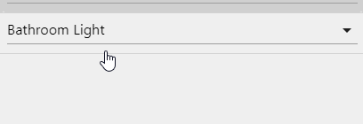
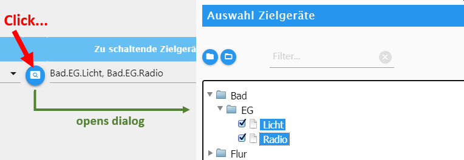
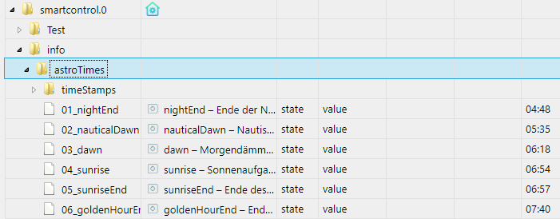
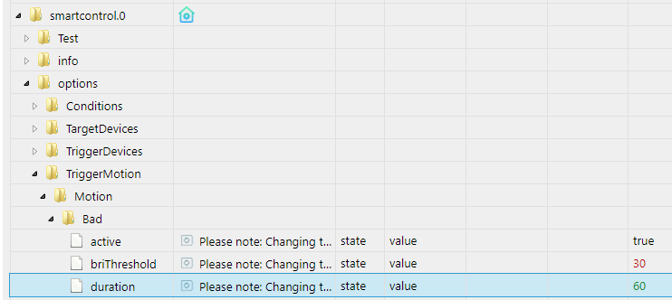
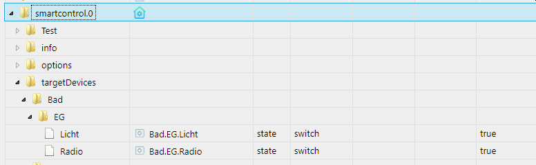
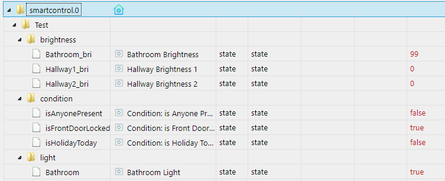

# Anleitung

## Wie konfiguriere ich diesen Adapter?

Du gehst einfach durch die einzelnen Options-Seiten (obige Reiter) wie folgt durch:

| Reiter | Was machen |
|--------|------------|
|1. ZIELGERÄTE | Hier trägst du all deine zu schaltenden Ziel-Geräte ein, also Lampen, Radio, usw. |
|2. ZUSÄTZLICHE BEDINGUNGEN | *Optional*: Hier trägst du zusätzliche Bedingungen ein, die (nicht) zutreffen sollen, z.B.: keiner anwesend, Feiertag heute, usw. |
|3. AUSLÖSER |Hier trägst du Auslöser ein, also z.B. Bewegungsmelder, Wandschalter, etc., sowie ggf. zeitabhängige Auslöser (z.B. jeden Tag um 8:00 Uhr). |
|4. ZONEN |Hier führst du alles zusammen, in dem du alle "Zonen" definierst (z.B. Badezimmer 1.OG, Kaffeeecke, usw.) und Auslöser und zu schaltende Zielgeräte zuweist, sowie auch weitere Bedingungen zur Ausführung definierst. |
| WEITERE OPTIONEN | Hier kannst du weitere Adapter-Optionen einstellen. |

### Hinweis: Auswahl-Felder (Drop-Down-Menüs) in Tabellen

Auswahlfelder (Drop-Down-Menüs), die mehrere selektierbare Werte bieten, müssen "an der Seite" angeklickt werden. Dies ist ein Issue des ioBroker-Admin-Adapters, und nicht von Smart Control. [Das Issue ist gemeldet und adressiert](https://github.com/ioBroker/ioBroker.admin/issues/590) im ioBroker Admin Adapter, und wird mit dem nächsten Update kommen.

 Einfache Abhilfe: Klicke einfach auf den blauen Button links daneben, dann bekommst du einen besseren Auswahl-Dialog:

## Adapter-Datenpunkte

### smartcontrol.x.info.astroTimes

Hier findest du alle aktuellen Astrozeiten deiner Geo-Koordinaten, die du in den ioBroker-Admin-Optionen (Schraubschlüssel oben links) eingestellt hast.

### smartcontrol.x.options

Hier kannst du für jede Optionen-Tabelle einzelne Zeilen an- und abschalten (Datenpunkt `active`).
 Zudem kannst du für alle Bewegungsmelder die Zeit in Sekunden (Datenpunkt `duration`) und die Grenze für die Helligkeit (Datenpunkt `briThreshold`) ändern.

**Bitte beachten:** Eine Änderung dieser Datenpunkte bewirkt einen Neustart der Adapter-Instanz, damit die Änderungen greifen können.

### smartcontrol.x.targetDevices

Für jede Tabellenzeile unter "1. ZIELGERÄTE" fügt der Adapter hier verknüpfte Datenpunkte hinzu. Wenn du diese Datenpunkte änderst, wird der ursprüngliche Ziel-Datenpunkt entsprechend geändert, und umgekehrt.

### smartcontrol.x.Test

Hier stehen dir Datenpunkte rein zum Testen des Adapters zur Verfügung. Diese Datenpunkte stellen keinerlei Funktionen oder Features zur Verfügung und dienen eben nur zum Testen dieses Adapters. Nach der ersten Installation einer Instanz dieses Adapters sind die Adapteroptionen mit einigen dieser Datenpunkte vorbelegt. Beginne z.B. mit dem Testen, indem du z.B. einen Auslöser-Datenpunkt aktivierst, also z.B. `smartcontrol.0.Test.trigger.Bathroom_motion` auf `true` setzt. Dann prüfst du, ob etwas ausgelöst wird (basierend auf den Einstellungen in "4. ZONEN" etc.).
 Das ioBroker-Log (ioBroker Admin > Log) liefert detaillierte Informationen. Für das Debugging setzt du bitte den Log-Level der Adapterinstanz auf 'debug', damit du viel mehr Informationen im Log erhältst.

### Du brauchst Hilfe? Es gibt ein Problem? Du hast einen Verbesserungsvorschlag?

| Um was geht es dir? | Wie du vorgehst |
|--------|------------|
|Ich habe eine Frage|Frage am besten im ioBroker-Forum, idealerweise referenzierst du @Mic so dass ich als Entwickler eine Meldung bekomme. Aktueller Forum-Thread für diesen Adapter ist hier ersichtlich: [ioBroker SmartControl Splash Page](https://forum.iobroker.net/topic/36728/).|
|Ich habe einen Fehler/Bug | Zunächst: Prüfe das ioBroker Log auf sämtliche Hinweise und gehe diesen entsprechend nach. Falls du nicht sicher bist, ob du alles richtig gemacht hast in den Adapter-Einstellungen, siehe oben -> *Ich habe eine Frage*. Falls du wirklich einen durch diesen Adapter verursachten Fehler hast: 1. Gehe zu [GitHub: Smart Control Issues](https://github.com/Mic-M/ioBroker.smartcontrol/issues) und erstelle ein neues Issue.  2. Bitte beschreibe **ausführlich** die Problematik und Schritt für Schritt, was du getan hast als/bevor der Fehler auftrat. Setze außerdem das Log Level des Adapters auf "Debug", reproduziere den Fehler und stelle die Logausgabe in Code-Tags im Issue ein. ioBroker schneidet Log-Zeilen ab, daher gehst du dazu bitte direkt ins Logfile (durch Klicken auf "Download Log").  3. Füge Screenshots hinzu, soweit möglicherweise hilfreich für mich als Entwickler 4. Füge den Adapter-Optionen-Export hinzu, sofern möglicherweise sinnvoll zur Fehlersuche für mich: Ganz oben rechts in den SmartControl-Adapter-Optionen den blauen Button "Pfeil nach unten" anklicken.|
|Ich möchte ein neues Feature vorschlagen| Mache ein neues Github-Issue auf unter [GitHub: Smart Control Issues](https://github.com/Mic-M/ioBroker.smartcontrol/issues), in Deutsch oder Englisch. Wenn Deutsch deine Muttersprache ist, dann schreibe auch bitte in Deutsch und nicht Englisch auf Github. Das macht unsere Kommunikation deutlich einfacher und du brauchst dir keinen abbrechen :-) Nicht deutsch sprechende User können das dennoch dank Google Translate o.ä. super mitlesen und sich einbringen.
 |